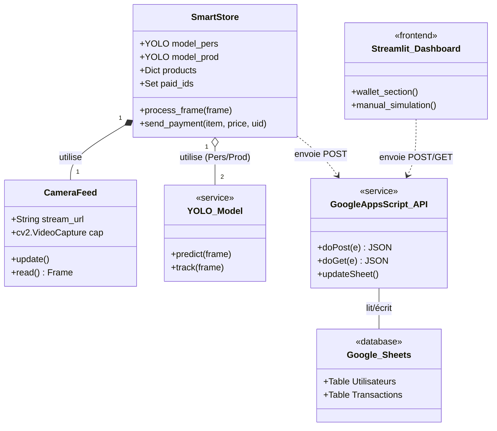
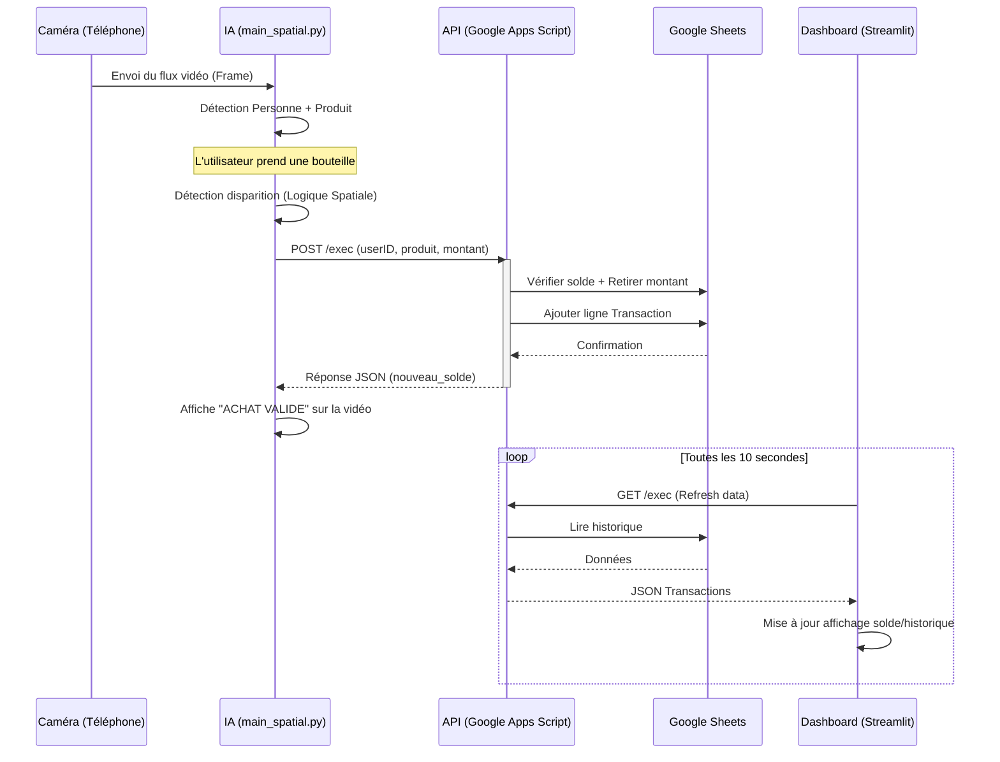

# Architecture UML - Pick & Go

Ce document présente l'architecture technique du projet via des diagrammes Mermaid.

## 1. Diagramme de Classe (Structure du Système)

## 2. Diagramme de Séquence (Flux d'Achat Pick & Go)

## 3. Description des Composants

*   **main_spatial.py** : Le cerveau du projet. Il gère la vision par ordinateur, le tracking botsort et la logique de proximité entre le client et l'objet.
*   **google_apps_script.js** : Le backend "Serverless" qui sécurise les calculs de solde et gère l'écriture dans le tableur.
*   **app.py** : L'interface utilisateur premium permettant au client de suivre ses dépenses et de simuler des recharges.
*   **.env** : Centralise la connectivité (IP de la caméra et URL du serveur Cloud).
